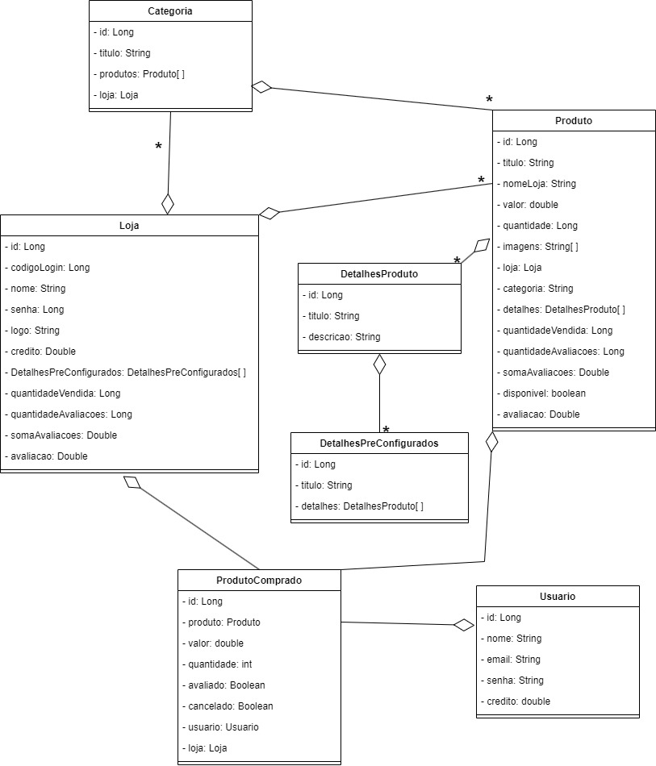

# Spring Boot Software de E-Commerce baseado na Amazon
Back-end com o framework Spring Boot de uma plataforma de E-Commerce baseada na Amazon. Esta aplicação complementa um front-end construído em Typescript com Angular está em outro repositório do perfil: [clique aqui!](https://github.com/YuriKevin/Angular_E-Commerce)  

## Funcionamento do sistema: 
[Assista ao vídeo](https://www.youtube.com/watch?v=-Amu7M3hCvQ)

## Outros vídeos relacionados:
[Algoritmo que indica produtos com base no interesse do usuário](https://www.youtube.com/watch?v=GqyikTsfetY)
[Algoritmo de responsividade](https://www.youtube.com/watch?v=VdYWJJz7kg4)
[Timelapse construção do HTML & CSS](https://www.youtube.com/watch?v=Tjv2n7l7SxY)

## O que este back-end possibilita?
- É uma API RESTful;
- Mais de 70 métodos para uso;
- Realiza um CRUD completo;
- Persiste dados em banco de dados relacional (MySQL);
- Lojas podem:
    1. Realizar cadastro;
    2. Cadastrar produtos;
    3. Oferecer reembolso aos seus clientes;
    4. Personalizar suas informações e sua página de perfil;
    5. Receber avaliação;
    6. Listar vendas realizadas;
    7. Procurar por uma venda específica;
    8. Ativar/Desativar os produtos de sua loja;
       
- O usuário consegue:
    1. Realizar cadstro;
    2. Comprar produtos;
    3. Recarregar créditos;
    4. Atualizar seus dados;
    5. Avaliar produtos (consequentemente a avaliação também é utilizada para avaliar a loja);
    6. Listar compras realizadas
    7. Procurar por uma compra específica;

- Os produtos podem:
    1. Ser listados de diferentes formas, por: titulo, categoria, loja a qual pertencem, mais vendidos, mais recentes, entre outras maneiras;
    2. Ser atualizados;
    3. Ser marcados como indisponíveis (o que impossibilita a compra);
    4. Receber avaliação;
    5. Existe um algoritmo dedicado a buscar produtos com base no interesse do usuário [Assista ao vídeo do algoritmo](https://www.youtube.com/watch?v=GqyikTsfetY).

- O sistema possui validações que impedem:
     1. Um usuário de comprar produtos sem ter o crédito em sua conta;
     2. Um usuário realizar login com as credenciais incorretas;
     3. Um usuário de comprar produtos indisponíveis;
     4. Um usuário de comprar um produto com quantidade inferior a desejada;
     5. Uma loja de adicionar mais que 6 imagens em um produto;
     6. entre outras...

## Como utilizar?
Para utilizar esta aplicação, execute-a na porta 8080 (padrão do Spring).  
Não se esqueça de executar o front-end junto! [(front-end)](https://github.com/YuriKevin/Angular_E-Commerce)

## Diagrama de Classes

